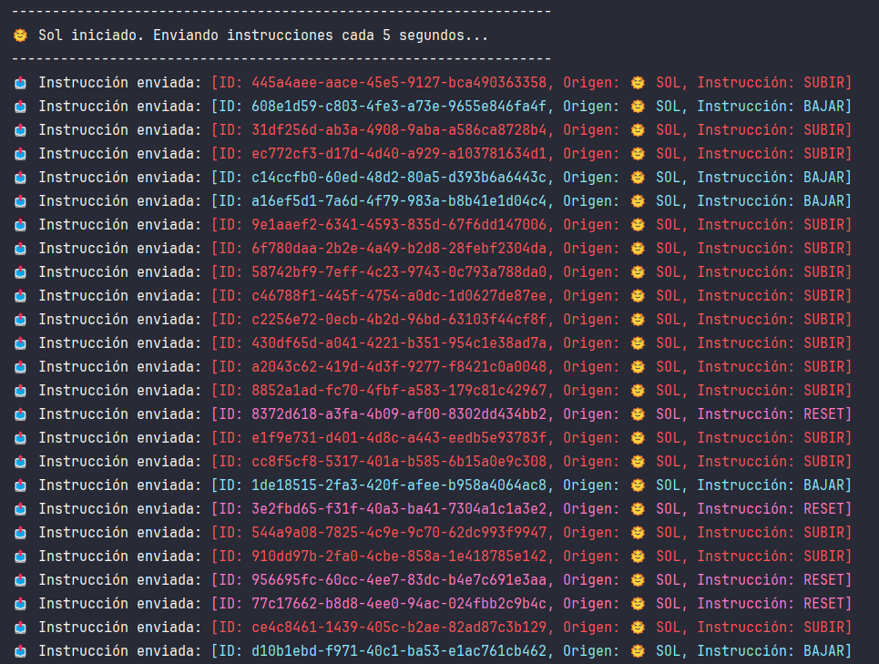
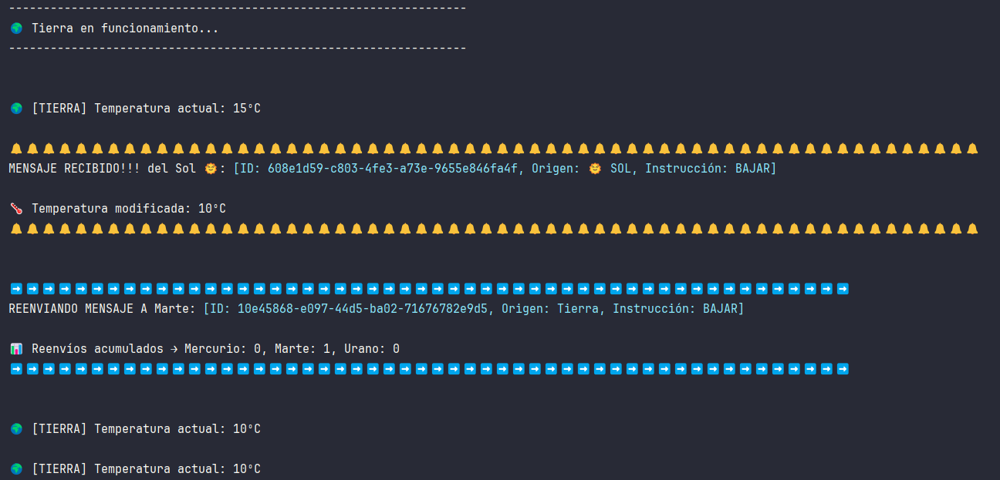
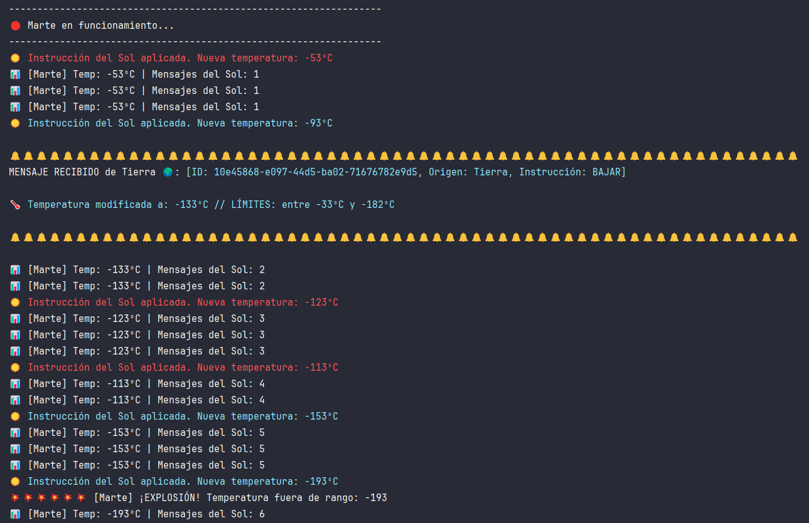
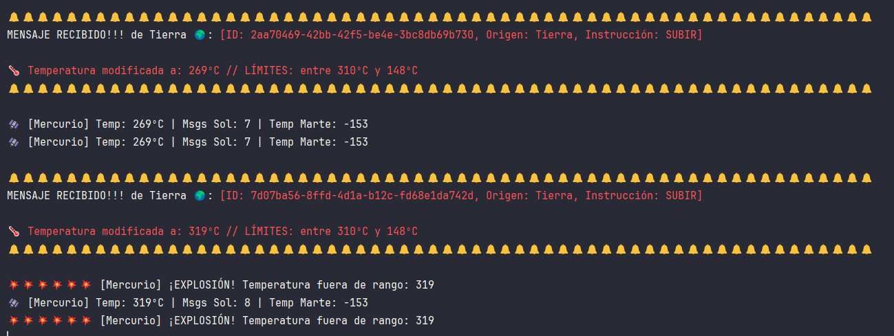

# 🌌 Sistema Solar Distribuido – Java + Sockets (TCP/UDP)

Simulación interactiva de un **sistema solar distribuido** desarrollada en **Java**, utilizando **Sockets TCP** y **UDP multicast** para la comunicación entre procesos.  
El proyecto modela el comportamiento de varios planetas y el Sol, con reglas físicas simplificadas y eventos aleatorios que afectan a la temperatura de cada planeta, pudiendo provocar explosiones si se superan ciertos límites.

Este proyecto forma parte de mi **porfolio profesional** como desarrollador de software, demostrando conocimientos en programación concurrente, comunicaciones en red y diseño modular.

---

## 🚀 Características Principales
- Comunicación **UDP Multicast** para envío de mensajes desde el Sol a todos los planetas.
- Comunicación **TCP** entre planetas para intercambio de instrucciones.
- Gestión de **mensajes duplicados** mediante UUID.
- Comportamientos independientes por planeta, con umbrales de temperatura específicos.
- Sistema de **eventos aleatorios** que afectan a la simulación.
- Posibilidad de explosiones por condiciones extremas.
- Registro y seguimiento en **consola** del estado de cada planeta.

---

## 🪐 Comportamiento de los Componentes

### ☀️ Sol
- Genera una orden aleatoria (`SUBIR`, `BAJAR` o `RESET`) cada 5 segundos.
- Envía instrucciones mediante **UDP Multicast** a todos los planetas.
- No garantiza entrega (propio de UDP).

### 🌍 Tierra
- Recibe mensajes multicast del Sol y modifica su temperatura.
- Reenvía instrucciones por **TCP** a otro planeta, con probabilidad:
  - 60% → Mercurio
  - 10% → Marte
  - 30% → Urano
- No explota, actúa como nodo intermedio y estable.

### ☿ Mercurio
- Recibe mensajes TCP desde Tierra y datos de temperatura de Marte por UDP.
- Cambios de temperatura bruscos:
  - `SUBIR`: +50°C
  - `BAJAR`: -10°C
- Explota si temperatura > 310°C o < 148°C.

### 🔴 Marte
- Aplica instrucciones del Sol (UDP) y de Tierra (TCP).
- Envía temperatura a Mercurio cada 100ms (UDP).
- Muy vulnerable a descensos (`BAJAR`: -40°C).
- Rango seguro: -182°C a -33°C.

### 💠 Urano
- Solo recibe mensajes TCP desde Tierra.
- Cambios de temperatura:
  - `SUBIR`: +5°C
  - `BAJAR`: -80°C
- Rango seguro: -374°C a -177°C.

---

## 📊 Ejecución y Resultados
En pruebas realizadas:
- **Sol**: instrucciones enviadas puntualmente cada 5s.
- **Tierra**: reenvío y distribución correcta según probabilidades.
- **Marte**: explosiones frecuentes por acumulación de órdenes de `BAJAR`.
- **Mercurio**: explosiones rápidas con varias órdenes de `SUBIR`.
- **Urano**: más estable, pero sensible a acumulaciones de `SUBIR`.

---

## 📷 Capturas de Pantalla
Aquí va un poco de apoyo visual para observar cómo actúa cada elemento:

  
  
  
  

---

## 🛠️ Tecnologías y Herramientas
- **Java SE**
- **Sockets TCP/UDP**
- **UDP Multicast**
- **Programación Concurrente**
- **UUID** para gestión de duplicados
- **Control de flujo y manejo de hilos**

---
